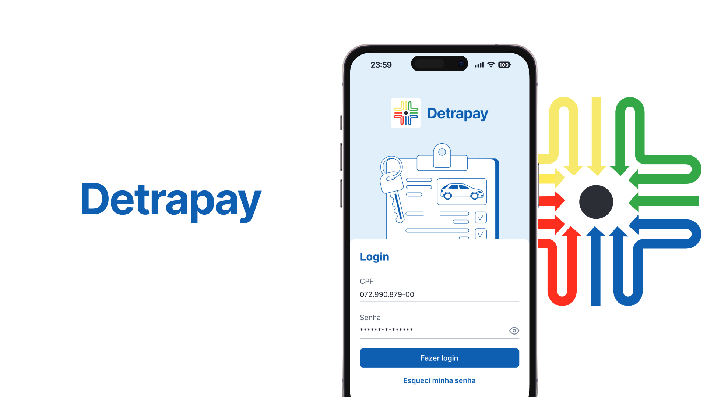
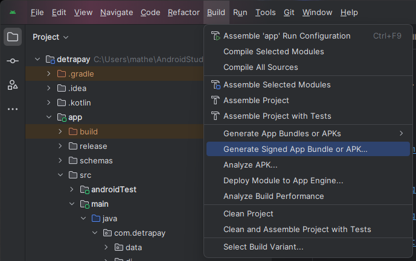
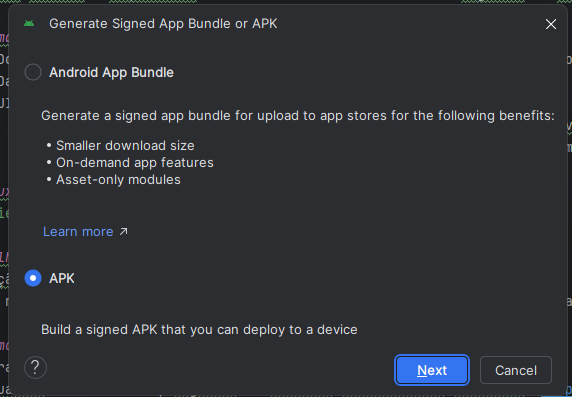
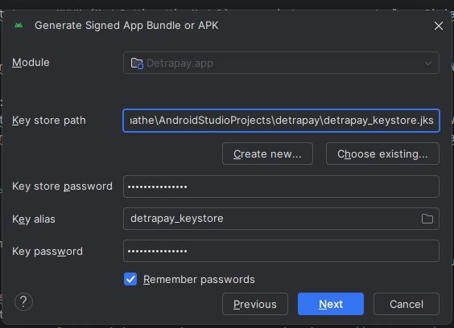
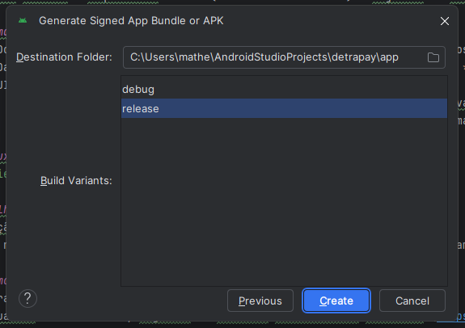
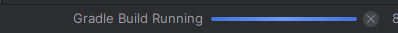
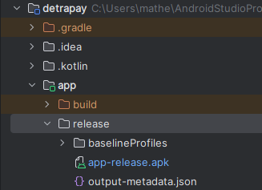

# Detrapay app

Detrapay android App. 

# Figma prototype
https://www.figma.com/design/kaYue0garwFpzIRLo1Xgyk/Detrapay?node-id=4569-1291&p=f&t=DiQY4Sp55yiKGpFT-0

# Payment SDK
https://developer.pagbank.com.br/docs/integracao-smartpos

https://developer.pagbank.com.br/docs/smartpos

https://pagseguro.github.io/pagseguro-sdk-plugpagservicewrapper/index.html

## 🏗️ Arquitetura e Estrutura

O Detrapay utiliza a arquitetura **MVVM (Model-View-ViewModel)** fundamentada nos princípios da **Clean Architecture**. Essa escolha foi feita para garantir que a lógica de pagamentos seja independente da interface e facilmente testável.

### 📐 Organização em Camadas

1.  **Domain (Core)**:
    - Contém as **Entities** (modelos de negócio) e **Use Cases**.
    - É o coração do app, onde reside a regra de negócio (ex: processamento de checkout).
    - Camada 100% Kotlin, sem dependências do Android.

2.  **Data**: Responsável pelo acesso aos dados e abstração da fonte de informação.
    - **Repositories**: Atuam como mediadores entre a camada de Domain e os Data Sources. Eles decidem se os dados devem vir do cache local ou da rede.
    - **Remote Data Source (Retrofit)**: Gerencia as chamadas de API para o backend do Detrapay, lidando com autenticação e mapeamento de DTOs.
    - **Local Data Source (Room/Preferences)**: Responsável pela persistência local para funcionamento offline ou cache de configurações.
    - **External SDK Source (PlugPag)**: Uma fonte de dados especializada que encapsula a comunicação com o hardware da SmartPOS via SDK do PagBank para processamento físico de cartões.

3.  **Presentation (UI)**:
    - **View**: Telas focadas apenas em renderizar o estado enviado pelo ViewModel.
    - **ViewModel**: Gerencia o estado da UI via `StateFlow` e lida com o ciclo de vida, disparando os casos de uso.

### 🛠️ Stack Tecnológica

[- **Coroutines & Flow**: Gerenciamento de operações assíncronas e fluxos de dados reativos.
- **Hilt**: Injeção de dependência para garantir baixo acoplamento.
- **Retrofit**: Cliente HTTP para consumo da API Backend.
- **PagBank PlugPag SDK**: Integração profunda para pagamentos em terminais SmartPOS.

### Fluxo de Dados:
`UI (View) -> ViewModel -> Use Case -> Repository -> Data Source`

### 🔄 Fluxo de Pagamento

O processo de pagamento segue um fluxo unidirecional e desacoplado, garantindo que a regra de negócio não dependa diretamente do hardware da SmartPOS:

1.  **OrderDetailsActivity**: O escolhe o pagamento previamente cadastrado que deseja realizar o pagamento (Crédito, Débito ou PIX) iniciando o processo de pagamento para a PaymentDialogFragment via intent.
2.  **PaymentDialogFragment**: Classe responsável por fazer a comunicação com a pagbank, salva o resultado da transação localmente e retorna via intent o resultado da transação para a OrderDetailsActivity.
3. **OrderDetailsActivity**: Recebe o resultado do pagamento, persiste o resultado remotamente, atualizando o status do pedido.

### 🔄 Fluxo de Estorno
1.  **OrderDetailsActivity**: O escolhe o pagamento previamente cadastrado que deseja realizar o pagamento (Crédito, Débito ou PIX) iniciando o processo de pagamento para a PaymentDialogFragment via intent.
2.  **RefundPaymentDialogFragment**: Classe responsável por fazer a comunicação com a pagbank, salva o resultado da transação localmente e retorna via intent o resultado da transação para a OrderDetailsActivity.
3. **OrderDetailsActivity**: Recebe o resultado do pagamento, persiste o resultado remotamente, atualizando o status do pedido.

### Melhorias 
* Criação de tipo dentro da entidade de Método de Pagamento no backend + mobile
* Caso não criem também é possível mover as lógicas de decisão do tipo de pagamento da UI para uma camada de adapter da resposta do backend, fazendo isso a camada de view só irá consumir a informação, evitando logicas repetidas.

### Como gerar uma nova versão do aplicativo?
1. - Abra o build.gradle.kts
2. - Atualize o versionName: sugestão de utilizar versionamento semantico (https://semver.org/lang/pt-BR/)
3. - Atualizar o versionCode: este atributo é um inteiro, cada nova versão para loja ele precisa ser incrementado
4. - Caso queira atualizar a URL do backend nesse mesmo arquivo altere as duas variáveis chamadas BASE_URL com a nova url
    * 4.1 - No processo de homologação nós informamos ao pagbank todas as urls utilizadas, caso essa URL seja atualizada pode ser necessário entrar em contato com a equipe deles para atualização e liberação das URLs em produção.
5. - Vá em BUILD > Generate Signed Bundle or APK 
* 5.1 - Selecione > APK 
* 5.2 - Preencha as informações necessárias para assinatura do apk 
    * 5.2.1  - Key store path: Para gerar novas versões do app é necessário utilizar uma chave de assinatura, esta chave encontra-se na raiz do projeto, o nome do arquivo é `detrapay_keystore.jks`
    * 5.2.2 - Key store password: 5l=R9gDh[!UX_N:
    * 5.2.3 - Key store alias: detrapay_keystore
    * 5.2.4 - Key password: 5l=R9gDh[!UX_N:
* 5.3 - Selecione RELEASE 
* 5.4 - O build será iniciado 
* 5.5 - Quando ele finalizar você podera obter o APK em -> `app/release/app-release.apk` 

## Design System (inicial)

Criamos um esqueleto inicial do Design System para centralizar tokens e componentes reutilizáveis.

- **Arquivos adicionados**:
    - `app/src/main/res/values/colors_design.xml` — cores semânticas (ds_primary, ds_secondary, ...)
    - `app/src/main/res/values/dimens_design.xml` — espaçamentos e dimens comuns
    - `app/src/main/res/values/styles_design.xml` — estilos base e `Widget.DS.Toolbar`
    - `app/src/main/res/layout/cmp_toolbar.xml` — componente toolbar reutilizável

Uso recomendado:

1. Preferir `@color/ds_*` e `@dimen/ds_*` em novos layouts em vez de valores hard-coded.
2. Ao extrair componentes, seguir o prefixo `cmp_` para layouts reutilizáveis (ex.: `cmp_toolbar.xml`).
3. Próximo passo sugerido: migrar `home_toolbar.xml` e toolbars existentes para usar `cmp_toolbar`.

